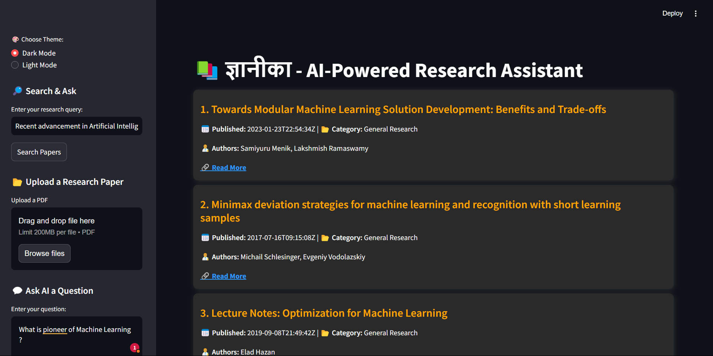
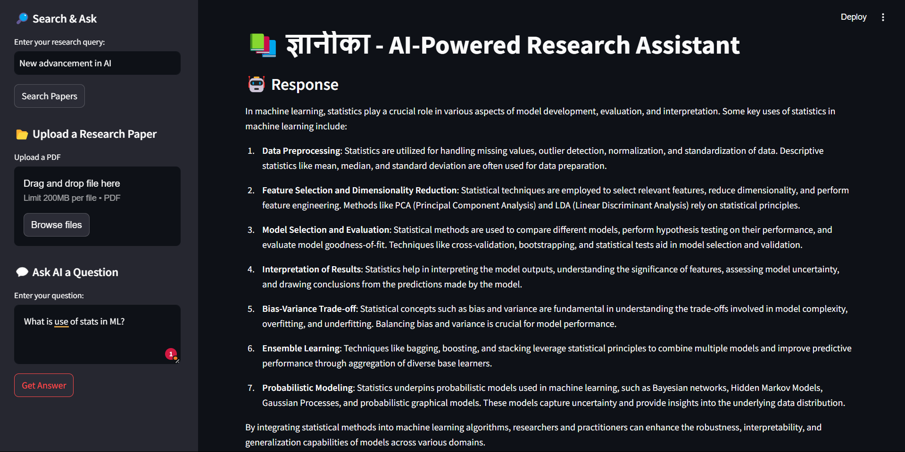

### 📚 ज्ञानीका - AI-Powered Research Assistant  

**An AI-driven research assistant that helps users find, summarize, and analyze academic papers, blogs, and PDFs using advanced NLP and Retrieval-Augmented Generation (RAG).**


---

## 🚀 Features

✅ **Smart Research Retrieval** - Fetches academic papers from arXiv API and stores them in ChromaDB for fast search.  
✅ **AI-Powered Summarization** - Uses OpenAI GPT to generate TL;DR summaries of research papers.  
✅ **Categorization by Topic** - Automatically classifies papers into fields like NLP, Robotics, Medicine, etc.  
✅ **Interactive Q&A** - Ask questions about research and get AI-powered answers.  
✅ **PDF Upload & Analysis** - Extracts and summarizes research papers directly from PDFs.  
✅ **Export Research as PDF** - Save research summaries for later use.  
✅ **Dark & Light Mode UI** - User-friendly interface with theme switching.  


---

## 🛠️ Tech Stack

- **Backend:** FastAPI, OpenAI GPT, ChromaDB, FAISS, SentenceTransformers  
- **Frontend:** Streamlit (for interactive UI)  
- **APIs Used:** arXiv API (for research papers), OpenAI API (for summarization & Q&A)  
- **Other Tools:** pdfplumber (PDF processing), fpdf (PDF export)  

---


---

## 🔧 Installation & Setup

### 1️⃣ Clone the Repository
```sh
git clone https://github.com/your-username/AI-Research-Assistant.git
cd AI-Research-Assistant
```

### 2️⃣ Install Dependencies
```sh
pip install -r requirements.txt
```

### 3️⃣ Run the Application
```sh
streamlit run frontend/app.py
```

---

## 🚀 Deployment (Hugging Face Spaces)
1. Push your project to GitHub.  
2. Create a **Hugging Face Space** → Choose **Streamlit** as the app type.  
3. Connect your GitHub repo and deploy!  

---

## 📷 Screenshots
#### **Paper Search & Categorization**


#### **AI-Powered Summarization**



---

## 🤝 Contributing
Feel free to fork this project and contribute! For major changes, open an issue first to discuss what you’d like to improve.

---

## 📝 License
This project is licensed under the **MIT License** - see the [LICENSE](LICENSE) file for details.

---

## ⭐ Acknowledgments
Special thanks to **OpenAI, arXiv, ChromaDB, and the Streamlit community** for making this possible!

📌 **If you like this project, give it a ⭐ on GitHub!** 🚀

## I am student; I am learning and trying to be a better 
